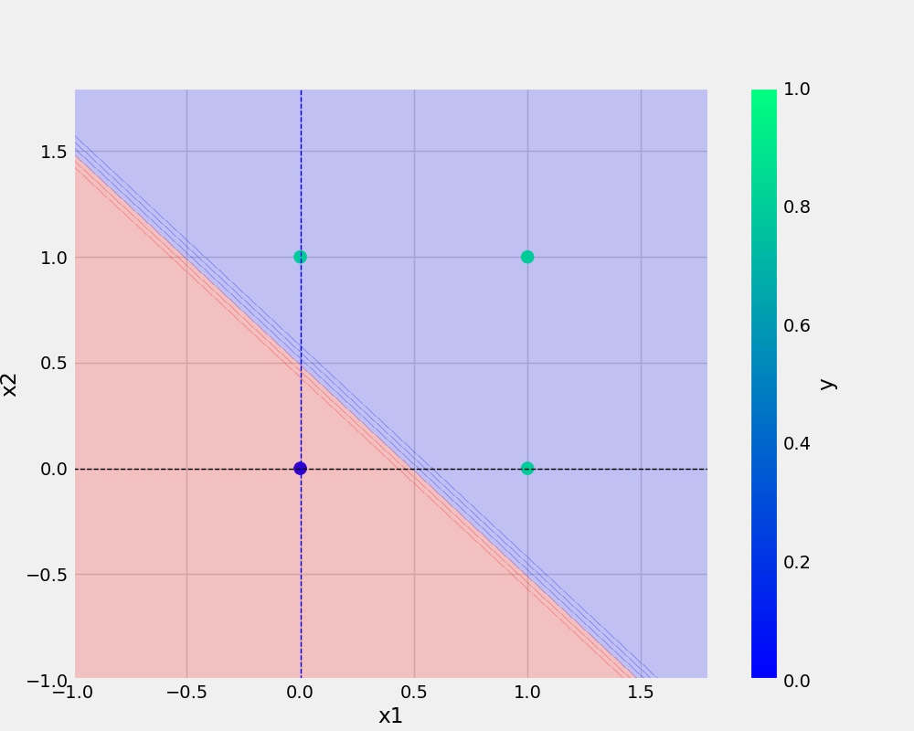

# oneNeuron
oneNeuron|Perceptron

```bash
git add . && git commit -m "docstring update" && git push origin main
```

## Add url
[Git Handbook](https://guides.github.com/introduction/git-handbook/)

<a href="https://www.w3schools.com">Visit W3Schools.com!</a>

## Add image



## And table
x1|x2|y
-|-|-
0|0|0
1|0|0
0|1|0
1|1|1

## Python code

```python
def add_num(x1,x2):
    return x1+x2
```     

## Notes
* point 1
* point 2
